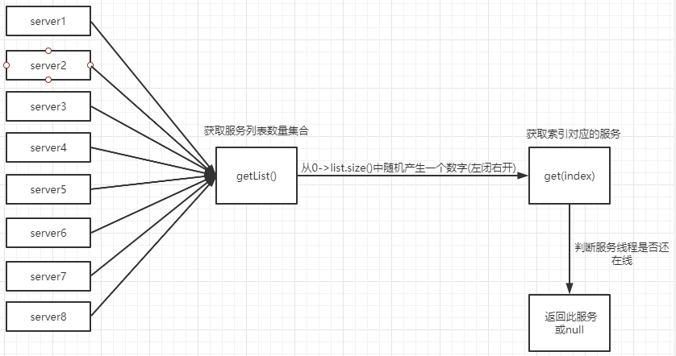

# ribbon-负载均衡算法

------

@Author：zxw

@email：502513205@qq.com

@school：吉首大学

------

# 1. 前言

​	最近在学习ribbon时了解到有一个负载均衡的机制，代码如下，相信很多人都使用过。

```java
@LoadBalanced
@Bean
public RestTemplate restTemplate(){
    return new RestTemplate();
}
```

# 2.轮询算法

轮询算法的重点还是在于保持顺序性，在源码中保持顺序的方法是使用一个atomicInteger变量，通过CAS算法进行值设置，如果设置成功，则修改设置值来保证轮询。

```java
public int incrementAndGetModulo(int modulo) {
    int current;
    int next;
    do {
        // 获取当前值
        current = this.nextServerCyclicCounter.get();
        // 当前值+1
        // 求余保证值在索引范围内
        next = (current + 1) % modulo;
        // CAS设置值
    } while (!this.nextServerCyclicCounter.compareAndSet(current, next));
    return next;
}
```

# 3.随机算法

先看看ribbon随机算法的实现，其实随机算法很容易理解，就是从一堆列表中随机产生一个就行了。如下图：



代码实现：

```java
public Server choose(ILoadBalancer lb, Object key) {
    if (lb == null) {
        return null;
    } else {
        Server server = null;
		// 判断服务是否为空
        while(server == null) {
            // 判断当前线程是否中断
            if (Thread.interrupted()) {
                return null;
            }
			// 获取可用的服务
            List<Server> upList = lb.getReachableServers();
            // 获取服务列表
            List<Server> allList = lb.getAllServers();
            // 服务列表数量
            int serverCount = allList.size();
            // 判断数量是否为空
            if (serverCount == 0) {
                return null;
            }
			// 随机获取一个索引
            int index = this.chooseRandomInt(serverCount);
            // 获取当前索引对应的服务
            server = (Server)upList.get(index);
            // 如果服务为空，则释放线程资源
            if (server == null) {
                Thread.yield();
            } else {
                // 判断服务是否存活
                if (server.isAlive()) {
                    return server;
                }
				
                server = null;
                //  释放资源
                Thread.yield();
            }
        }

        return server;
    }
}

protected int chooseRandomInt(int serverCount) {
    // 随机产生一个 0-serverCount之间的数字（左闭右开）
    return ThreadLocalRandom.current().nextInt(serverCount);
}
```

# 实战

## 1.随机算法：分布式锁商品抢购优化

在商品抢购中，为了防止商品超买和超卖会使用锁来控制访问，常见的有悲观锁、乐观锁、分布式锁、队列，redis原子操作等。此处我使用的是redsson的分布式锁。

产生问题：当使用锁来控制商品数量时，此时执行流程串行化会导致所有线程都在等待锁资源，这样会造成商品抢购的效率低下

解决方案之一：采用concurrentHashmap的分段锁思想，将商品数量拆分成多个段，然后每次用户访问时分发到不同的段中，以提高并发量。

代码实现：首先获取该商品keys前缀的所有分段集合，然后从中获取一个索引值，根据索引值从获取到的集合中获得当前key的lock并进行库存扣减。

```java
Object[] keys =  redisTemplate.keys(MS_REDIS_PREFIX + "?").toArray();
// 如果列表数量为0，则返回空
int keyCount = keys.length;
if (keyCount == 0) {
    return;
}
int index = this.chooseRandomInt(keyCount);
redissonClient.lock(keys[index] + "_" + index, TimeUnit.SECONDS, 5);
String value = redisTemplate.opsForValue().get(keys[index]);
if (value == null) {
    System.out.println("当前仓库:[" + MS_REDIS_PREFIX + index + "]库存为:" + value);
} else {
    if (Integer.valueOf(value) == 0) {
        redisTemplate.delete((String)keys[index]);
    } else {
        redisTemplate.opsForValue().decrement((String)keys[index]);
        System.out.println("仓库[" + keys[index] + "]:减少了一个商品，剩余" + redisTemplate.opsForValue().get(keys[index]));
    }
    redissonClient.unlock(keys[index] + "_" + index);
}
```

## 2.轮询算法

与上面的代码基本相同，最后测试结果也是按照轮询库存扣减

```java
Object[] keys = redisTemplate.keys(MS_REDIS_PREFIX + "?").toArray();
// 如果列表数量为0，则返回空
int keyCount = keys.length;
if (keyCount == 0) {
    return;
}
int index = this.incrementAndGetModulo(keyCount);
redissonClient.lock(keys[index] + "_" + index, TimeUnit.SECONDS, 5);
String value = redisTemplate.opsForValue().get(keys[index]);
if (value == null) {
    System.out.println("当前仓库:[" + MS_REDIS_PREFIX + index + "]库存为:" + value);
} else {
    if (Integer.valueOf(value) == 0) {
        redisTemplate.delete((String) keys[index]);
    } else {
        redisTemplate.opsForValue().decrement((String) keys[index]);
        System.out.println("仓库[" + keys[index] + "]:减少了一个商品，剩余" + redisTemplate.opsForValue().get(keys[index]));
    }
    redissonClient.unlock(keys[index] + "_" + index);
}
```