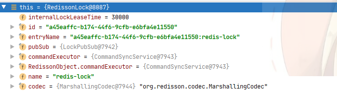
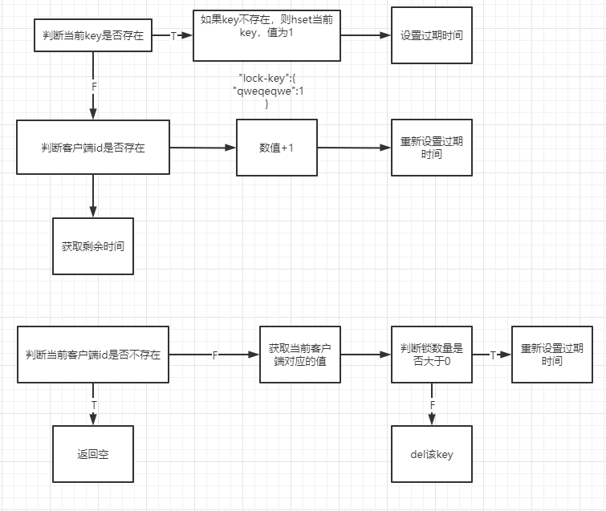
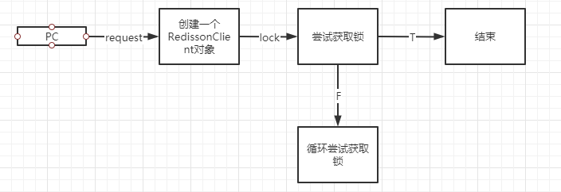

# redisson分布式锁源码解析
@Author：zxw

@email：502513205@qq.com

@school：吉首大学

------

# 1.前言

最近在学习了分布式锁的使用，其中的实现方式有redis原生，redisson，zookeeper等实现方式，以及对分布式锁的分段优化。在学习完分布式锁接下来就是深入了解下Redisson中分布式锁的实现方式。

# 2.实现

首先来看看Redisson的调用方式，创建一个工具类

```java
@Component
public class RedissonDistributedLocker implements DistributedLocker {
    @Autowired
    private RedissonClient redissonClient;

    public void lock(String lockKey) {
        RLock lock = redissonClient.getLock(lockKey);
        lock.lock();
    }

    public void unlock(String lockKey) {
        RLock lock = redissonClient.getLock(lockKey);
        lock.unlock();
    }

    public void lock(String lockKey, int timeout) {
        RLock lock = redissonClient.getLock(lockKey);
        lock.lock(timeout, TimeUnit.SECONDS);
    }

    public void lock(String lockKey, TimeUnit unit, int timeout) {
        RLock lock = redissonClient.getLock(lockKey);
        lock.lock(timeout, unit);
    }
}
```

比较简单，就是实现了加锁以及解锁的方法。在加锁处打一个断点进入方法内部看看。

`RLock lock = redissonClient.getLock(lockKey);`

调用此方法返回一个RLock对象实例，这边RLock的实现类比较多，有读写锁，公平锁等，这里我们返回默认的RedissonLock

```java
@Override
public RLock getLock(String name) {
    return new RedissonLock(connectionManager.getCommandExecutor(), name);
}
```

```java
public RedissonLock(CommandAsyncExecutor commandExecutor, String name) {
    super(commandExecutor, name);
    this.commandExecutor = commandExecutor;
    this.id = commandExecutor.getConnectionManager().getId();
    this.internalLockLeaseTime = commandExecutor.getConnectionManager().getCfg().getLockWatchdogTimeout();
    this.entryName = id + ":" + name;
    this.pubSub = commandExecutor.getConnectionManager().getSubscribeService().getLockPubSub();
}
```

大致上会得到这么几个参数



然后调用lock方法进行加锁

```java
lock.lock(timeout, TimeUnit.SECONDS);
```

```java
 private void lock(long leaseTime, TimeUnit unit, boolean interruptibly) throws InterruptedException {
    	// 获取线程id
        long threadId = Thread.currentThread().getId();
     	// 尝试获取锁
        Long ttl = tryAcquire(leaseTime, unit, threadId);
        // lock acquired
        if (ttl == null) {
            return;
        }

        RFuture<RedissonLockEntry> future = subscribe(threadId);
        if (interruptibly) {
            commandExecutor.syncSubscriptionInterrupted(future);
        } else {
            commandExecutor.syncSubscription(future);
        }

        try {
            while (true) {
                ttl = tryAcquire(leaseTime, unit, threadId);
                // lock acquired
                if (ttl == null) {
                    break;
                }

                // waiting for message
                if (ttl >= 0) {
                    try {
                        future.getNow().getLatch().tryAcquire(ttl, TimeUnit.MILLISECONDS);
                    } catch (InterruptedException e) {
                        if (interruptibly) {
                            throw e;
                        }
                        future.getNow().getLatch().tryAcquire(ttl, TimeUnit.MILLISECONDS);
                    }
                } else {
                    if (interruptibly) {
                        future.getNow().getLatch().acquire();
                    } else {
                        future.getNow().getLatch().acquireUninterruptibly();
                    }
                }
            }
        } finally {
            unsubscribe(future, threadId);
        }
//        get(lockAsync(leaseTime, unit));
    }
```

`RedissonLock.tryAcquire()`

```java
private Long tryAcquire(long leaseTime, TimeUnit unit, long threadId) {
    // 这里分为了两步
    // 第一步
    // 第二步
    return get(tryAcquireAsync(leaseTime, unit, threadId));
}
```

`tryLocInnerAsync`通过源码可以看到，Redisson设置了默认的过期时间，为3秒

```java
private <T> RFuture<Long> tryAcquireAsync(long leaseTime, TimeUnit unit, long threadId) {
    if (leaseTime != -1) {
        return tryLockInnerAsync(leaseTime, unit, threadId, RedisCommands.EVAL_LONG);
    }
    RFuture<Long> ttlRemainingFuture = tryLockInnerAsync(commandExecutor.getConnectionManager().getCfg().getLockWatchdogTimeout(), TimeUnit.MILLISECONDS, threadId, RedisCommands.EVAL_LONG);
    ttlRemainingFuture.onComplete((ttlRemaining, e) -> {
        if (e != null) {
            return;
        }

        // lock acquired
        if (ttlRemaining == null) {
            scheduleExpirationRenewal(threadId);
        }
    });
    return ttlRemainingFuture;
}
```

`tryLockInnerAsync`这里就是分布式锁的核心关键Lua语法表达式了，剩余后面的就是执行这段命令的代码就不往后深入。

```java
<T> RFuture<T> tryLockInnerAsync(long leaseTime, TimeUnit unit, long threadId, RedisStrictCommand<T> command) {
    internalLockLeaseTime = unit.toMillis(leaseTime);

    return evalWriteAsync(getName(), LongCodec.INSTANCE, command,
            "if (redis.call('exists', KEYS[1]) == 0) then " +
                    "redis.call('hincrby', KEYS[1], ARGV[2], 1); " +
                    "redis.call('pexpire', KEYS[1], ARGV[1]); " +
                    "return nil; " +
                    "end; " +
                    "if (redis.call('hexists', KEYS[1], ARGV[2]) == 1) then " +
                    "redis.call('hincrby', KEYS[1], ARGV[2], 1); " +
                    "redis.call('pexpire', KEYS[1], ARGV[1]); " +
                    "return nil; " +
                    "end; " +
                    "return redis.call('pttl', KEYS[1]);",
            Collections.singletonList(getName()), internalLockLeaseTime, getLockName(threadId));
}
```

接下来就对这段Lua代码进行分析看看到底做了什么事

```java
// keys[1]:表示redis-key，即你传入的key
// ARGV[2]:表示获取时间
// ARGV[3]:表示加锁的客户端id
// 如果当前key不存在，则加锁
if (redis.call('exists', KEYS[1]) == 0) then 
    // 将当前客户端id锁数量+1
    redis.call('hincrby', KEYS[1], ARGV[2], 1);
	// 设置毫秒过期时间
    redis.call('pexpire', KEYS[1], ARGV[1]);
return nil;
end;
// 判断
if (redis.call('hexists', KEYS[1], ARGV[2]) == 1) then
    redis.call('hincrby', KEYS[1], ARGV[2], 1);
	// 设置毫秒过期时间
	redis.call('pexpire', KEYS[1], ARGV[1]); 
	return nil; 
end;
// 返回准确的毫秒数
return redis.call('pttl', KEYS[1]);
```

解锁的lua实现

```java
if (redis.call('hexists', KEYS[1], ARGV[3]) == 0) then 
    return nil;
end; 
local counter = redis.call('hincrby', KEYS[1], ARGV[3], -1); 
if (counter > 0) then 
    redis.call('pexpire', KEYS[1], ARGV[2]); 
    return 0;
else 
    redis.call('del', KEYS[1]); 	
	redis.call('publish', KEYS[2], ARGV[1]);
	return 1;
end;
return nil;
```

现在通过下图来看看具体的流程



接下来看看总的执行流程

